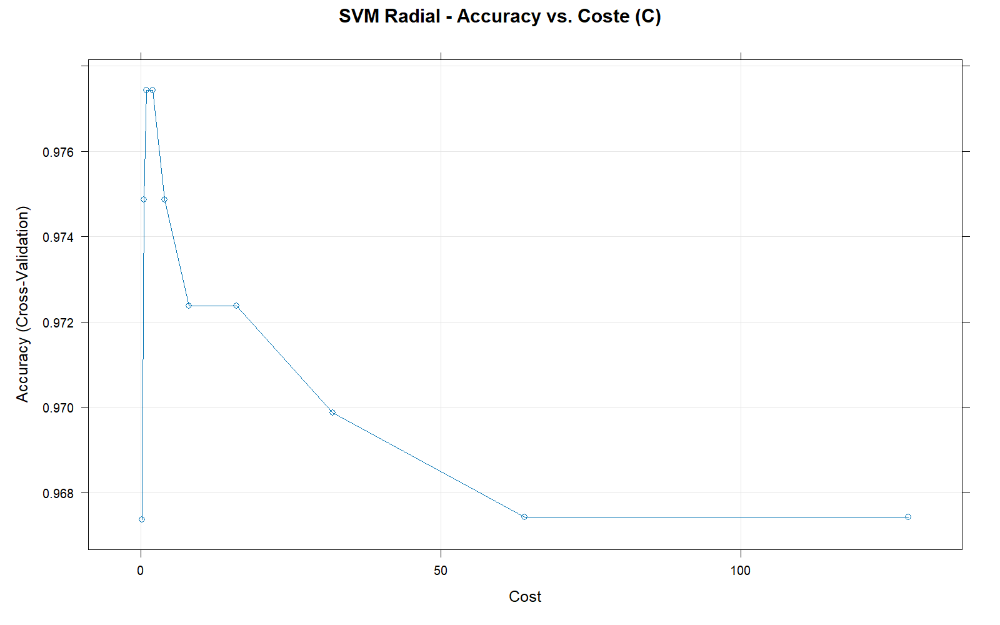
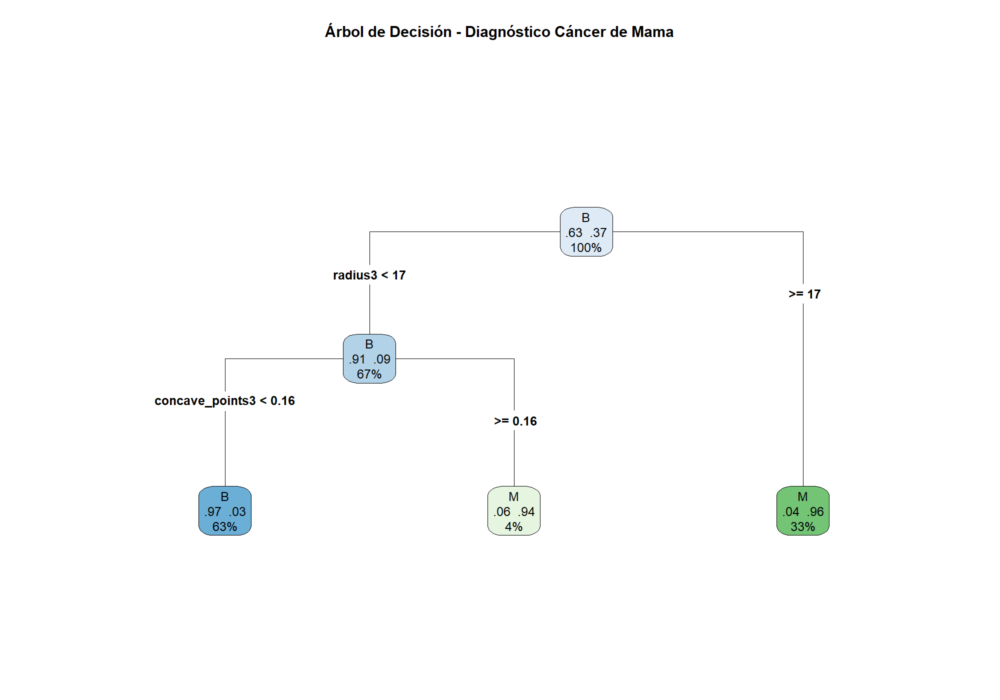
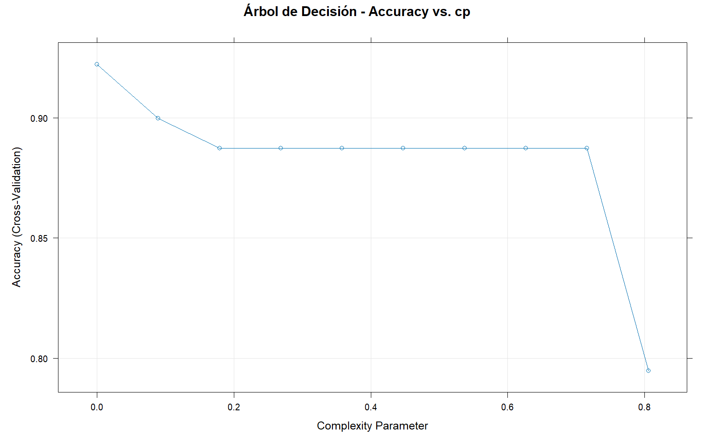
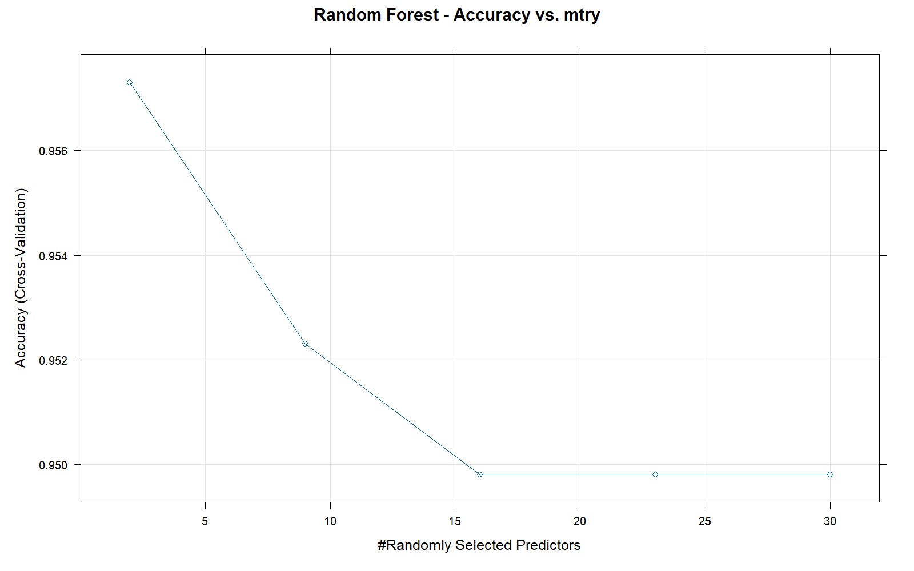
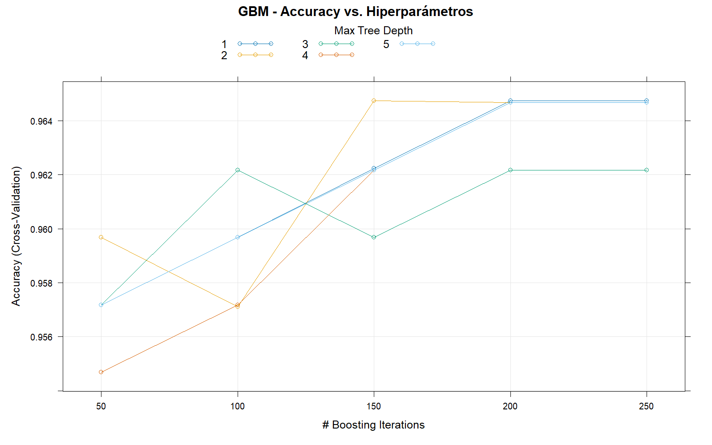
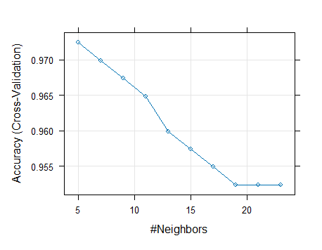
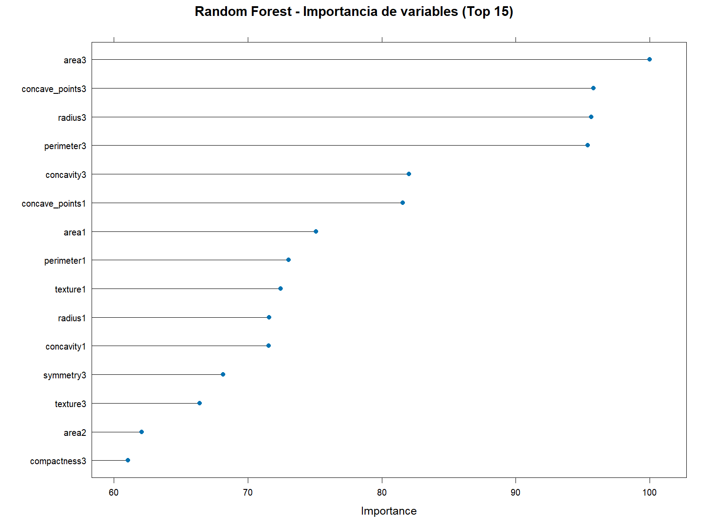

# Supervised Learning Applied to Breast Cancer Diagnosis

Supervised machine learning pipeline in R for breast cancer diagnosis classification KNN, SVM, Decision Tree, Random Forest and GBM with 10-fold cross-validation and ROC analysis.

# Supervised-Learning-Breast-Cancer


Aplicación de seis algoritmos de **aprendizaje supervisado** sobre el dataset Wisconsin Breast Cancer Diagnostic para clasificar tumores mamarios como malignos (M) o benignos (B) a partir de características morfológicas del núcleo celular.

---

## Descripción

Este proyecto forma parte de la asignatura **Algoritmos e Inteligencia Artificial** del Máster Universitario en Bioinformática (UNIR). Se implementa un pipeline completo de machine learning en R utilizando el framework `caret`, cubriendo desde la preparación de los datos hasta la comparación de modelos mediante curvas ROC.

### Dataset

**Wisconsin Breast Cancer Diagnostic (WBCD)** - 569 muestras, 30 variables numéricas derivadas de imágenes digitalizadas de aspirados con aguja fina (FNA) de masa mamaria.

| Variable objetivo | Descripción |
|---|---|
| `M` (Maligno) | 212 casos |
| `B` (Benigno) | 357 casos |

Las variables predictoras describen características del núcleo celular (radio, textura, perímetro, área, suavidad, compacidad, concavidad, simetría y dimensión fractal), calculadas como media, error estándar y peor valor observado.

| Característica | Detalle |
|---|---|
| Muestras | 569 pacientes |
| Variables predictoras | 30 (características morfológicas del núcleo celular) |
| Variable objetivo | `Diagnosis`: M = Maligno (212), B = Benigno (357) |
| Fuente | UCI Machine Learning Repository |

---

## Modelos implementados

| Modelo | Método en caret | Hiperparámetro optimizado |
|---|---|---|
| K-Nearest Neighbors | `knn` | Número de vecinos (k) |
| SVM Lineal | `svmLinear` | Coste (C) |
| SVM Radial (RBF) | `svmRadial` | Sigma, Coste (C) |
| Árbol de Decisión | `rpart` | Parámetro de complejidad (cp) |
| Random Forest | `rf` | Variables por nodo (mtry) |
| Gradient Boosting | `gbm` | n.trees, profundidad, shrinkage |

Todos los modelos se entrenaron con **validación cruzada de 10 folds** sobre el 70% de los datos, y se evaluaron sobre un conjunto de prueba independiente (30% del dataset).

---

## Estructura del repositorio

```
Supervised-Learning-Breast-Cancer/
│
├── Moreno_Caren_Actividad2_AlgoritmosIA.R   # Script principal (ejecutable)
│
├── data/
│   ├── data.csv                             # Dataset Wisconsin Breast Cancer
│   └── variables.csv                        # Documentación de variables
│
├── results/
│   ├── Resultados_accuracy_modelos.csv      # Tabla comparativa de Accuracy y Kappa
│   └── Resultados_AUC_modelos.csv           # Tabla comparativa de AUC por modelo
│
├── figures/                                 # Gráficos generados por el script
│   ├── 01_knn_tuning.png
│   ├── 02_svm_tuning.png
│   ├── 03_arbol_decision.png
│   ├── 04_arbol_tuning.png
│   ├── 05_rf_tuning.png
│   ├── 06_gbm_tuning.png
│   ├── 07_comparacion_accuracy.png
│   ├── 08_comparativa_curvas_roc.png
│   └── 09_importancia_variables_rf.png
│
├── docs/
│   └── mubio04_act2_ind.pdf                 # Enunciado de la actividad
│
├── .gitignore
└── README.md
```

---

## Cómo reproducir el análisis

### Requisitos

- R ≥ 4.0
- RStudio (recomendado)

### Pasos

**1. Clonar el repositorio**

```bash
git clone https://github.com/TU-USUARIO/Supervised-Learning-Breast-Cancer.git
cd Supervised-Learning-Breast-Cancer
```

**2. Verificar que los datos están en su lugar**

Asegurarse de que `data.csv` está dentro de la carpeta `data/`.  
El dataset original está disponible en el [UCI Machine Learning Repository](https://archive.ics.uci.edu/dataset/17/breast+cancer+wisconsin+diagnostic).

**3. Ajustar el directorio de trabajo en RStudio**

Abrir el proyecto en RStudio y ejecutar al inicio:

```r
setwd("ruta/a/Supervised-Learning-Breast-Cancer")
```

O usar directamente *Session → Set Working Directory → To Source File Location*.

**4. Ejecutar el script**

Abrir `Actividad2_AlgoritmosIA.R` en RStudio y ejecutar con `Ctrl + Shift + Enter`.

Los paquetes necesarios se instalan automáticamente si no están presentes. Las carpetas `figures/` y `results/` se crean solas al correr el script.

---

## Figuras generadas

| Figura | Descripción |
|---|---|
| `01_knn_tuning.png` | Accuracy en validación cruzada según el número de vecinos k |
| `02_svm_tuning.png` | Accuracy en validación cruzada según el coste C del SVM radial |
| `03_arbol_decision.png` | Estructura del árbol de decisión final con reglas de clasificación |
| `04_arbol_tuning.png` | Accuracy en validación cruzada según el parámetro de complejidad cp |
| `05_rf_tuning.png` | Accuracy en validación cruzada según mtry en Random Forest |
| `06_gbm_tuning.png` | Accuracy en validación cruzada según hiperparámetros del GBM |
| `07_comparacion_accuracy.png` | Gráfico comparativo del accuracy final de los cinco modelos |
| `08_importancia_variables_rf.png` | Top 15 variables más discriminantes según Random Forest |

---

## Principales resultados

> Los valores exactos de Accuracy y AUC dependen de la ejecución; los resultados reproducibles se almacenan en `/results`.

- **Random Forest** y **GBM** obtienen el mayor Accuracy y AUC en el conjunto de prueba, superando el 95% en ambos casos.
- El **Árbol de Decisión** individual es el modelo más interpretable aunque con menor rendimiento predictivo.
- Las variables más discriminantes identificadas por Random Forest corresponden a características del tercer momento estadístico: `concave_points3`, `perimeter3` y `area3`.

<table align="center" style="border: none; border-collapse: collapse;">
  <tr style="border: none;">
    <td align="center" style="border: none; padding: 10px;">
      <br>
      <sub><b>K-Nearest Neighbors</b></sub>
    </td>
    <td align="center" style="border: none; padding: 10px;">
      <br>
      <sub><b>SVM Turing</b></sub>
    </td>
    <td align="center" style="border: none; padding: 10px;">
      <br>
      <sub><b>Árbol Decisión</b></sub>
    </td>
    <td align="center" style="border: none; padding: 10px;">
      <br>
      <sub><b>Árbol Tuning</b></sub>
    </td>
  </tr>
</table>

<table align="center" style="border: none; border-collapse: collapse;">
  <tr style="border: none;">
    <td align="center" style="border: none; padding: 10px;">
      <br>
      <sub><b>RF Tuning</b></sub>
    </td>
    <td align="center" style="border: none; padding: 10px;">
      <br>
      <sub><b>GBM Tuning</b></sub>
    </td>
    <td align="center" style="border: none; padding: 10px;">
      <br>
      <sub><b>Comparación Accuracy</b></sub>
    </td>
    <td align="center" style="border: none; padding: 10px;">
      <br>
      <sub><b>Importancia Variables RF</b></sub>
    </td>
  </tr>
</table>

### Curvas ROC

<p align="center">
  
</p>

La comparación de las curvas ROC sobre el conjunto de prueba muestra que cuatro de los cinco modelos alcanzan un rendimiento discriminativo muy alto. SVM (AUC = 0.999) y GBM (AUC = 0.998) obtienen los mejores resultados, con curvas que se aproximan al vértice superior izquierdo de forma casi perfecta, lo que indica una capacidad casi ideal para separar tumores malignos de benignos. Random Forest (AUC = 0.997) y KNN (AUC = 0.994) presentan un comportamiento muy similar, manteniéndose también muy por encima del clasificador aleatorio (línea diagonal punteada). El Árbol de Decisión individual (AUC = 0.937) es el modelo con menor rendimiento, con una curva más escalonada y alejada del vértice óptimo, lo que refleja su mayor simplicidad estructural y menor capacidad para generalizar en comparación con los métodos ensemble. En conjunto, estos resultados confirman que todos los modelos son adecuados para esta tarea de clasificación clínica, aunque los métodos basados en ensemble superan claramente al árbol de decisión individual.

---

## Paquetes utilizados

```r
tidyverse · caret · e1071 · rpart · rpart.plot · rattle
randomForest · gbm · pROC · PRROC · gridExtra
```

---

## Autora

**Caren Nicole Moreno**  
Máster Universitario en Bioinformática - UNIR  
Asignatura: Algoritmos e Inteligencia Artificial
